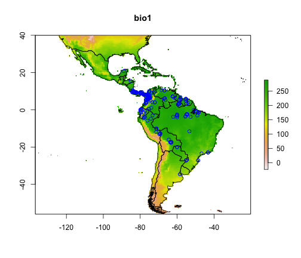

## rgbif use case No. 1 - Ecological niche modelling (aka species distribution modelling)

In this example, we plot actual occurrence data for *Bradypus* species against a single predictor variable, BIO1 (annual mean temperature). This is only ont step in a species distribution modelling workflow.


### Load libraries


```coffee
library(rgbif)
library(dismo)
library(maptools)
```


### Make a list of files that are installed with the dismo package, then create a rasterStack from these


```coffee
files <- list.files(paste(system.file(package = "dismo"), "/ex", sep = ""), 
    "grd", full.names = TRUE)
predictors <- stack(files)
```


### Get world boundaries.


```coffee
data(wrld_simpl)
```


### Get GBIF data using the rOpenSci package rgbif.


```coffee
df <- occurrencelist(scientificname = "bradypus*", coordinatestatus = TRUE, 
    maxresults = 500)
df <- gbifdata(df, coordinatestatus = TRUE)
df2 <- data.frame(lon = df$decimalLongitude, lat = df$decimalLatitude)
```


### Plot: (1) Add raster data, (2) Add political boundaries, (3) Add the points (occurrences)


```coffee
plot(predictors, 1)
plot(wrld_simpl, add = TRUE)
points(df2, col = "blue")
```

 


### Further reading

The above example comes from [this tutorial][sdm] on species distribution modeling. 

[sdm]: http://cran.r-project.org/web/packages/dismo/vignettes/sdm.pdf
